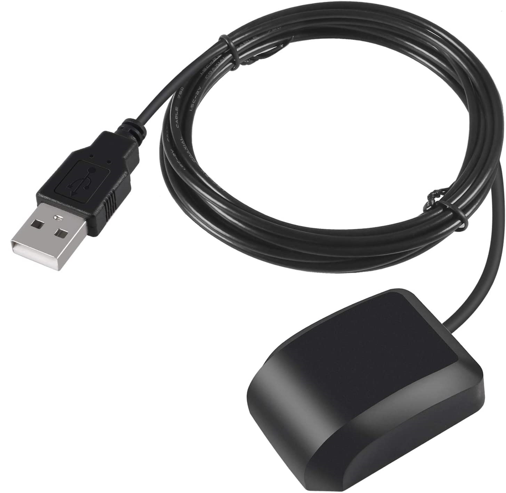

[](https://hub.docker.com/r/fitzdockerhub/ntp-gps)


# __NTP-GPS__ 
A bare minimum GPS Stratum 1 NTP server, using an inexpensive ($7-15) [USB-A GPS reciever](https://smile.amazon.com/s?k=usb+gps+receiver/)

## About:
This container runs [NTPsec](https://www.ntpsec.org/) and [gpsd](https://gpsd.io/), built on the Docker [Alpine](https://hub.docker.com/_/alpine) image.

# - USB Reciever -
Tested using the VK-162 GMOUSE USB External GPS Navigation Module [u-blox]

&ensp;

**Chipset properties**
> Main chip: u-blox \
> Receive frequency: L1 [1575.42MHz] \
> Tracking Channels: 50 \
> Support DGPS [WAAS, EGNOS, and MSAS]

# - Configure -
## <u>Discover Reciever Mounted Path</u>
Running the following bash script will display what USB devices are connected and path they're mounted

> Take note of the /dev/___\<Device>___ location
 ```
for sysdevpath in $(find /sys/bus/usb/devices/usb*/ -name dev); do (
    syspath="${sysdevpath%/dev}"
    devname="$(udevadm info -q name -p $syspath)"
    [[ "$devname" == "bus/"* ]] && exit
    eval "$(udevadm info -q property --export -p $syspath)"
    [[ -z "$ID_SERIAL" ]] && exit
    echo -e "\n### $ID_SERIAL ###\n/dev/$devname"
) done
```
### Example:
<pre>
$> for sysdevpath in $(find /sys/bus/usb/devices/usb*/ -name dev); do (
>    syspath="${sysdevpath%/dev}"
>    devname="$(udevadm info -q name -p $syspath)"
>    [[ "$devname" == "bus/"* ]] && exit
>    eval "$(udevadm info -q property --export -p $syspath)"
>    [[ -z "$ID_SERIAL" ]] && exit
>    echo -e "\n### $ID_SERIAL ###\n/dev/$devname"
> ) done

### u-blox_AG_-_www.u-blox.com_u-blox_7_-_GPS_GNSS_Receiver ###
/dev/<b>ttyACM0</b>

### u-blox_AG_-_www.u-blox.com_u-blox_7_-_GPS_GNSS_Receiver ###
/dev/<b>ttyACM1</b>
</pre>

#  - Install -
## <u>Auto Configure:</u>
The following will mount all devices in /dev to the container, and gpsd will default to USB hotplugging to add new USB devices automatically to the daemon
```
docker run -d \
  --name=ntp-gps \
  --restart=unless-stopped \
  --cap-add SYS_TIME \
  --device=/dev/ \
  -e TZ=$(cat /etc/timezone) \
  -p 123:123/udp \
fitzdockerhub/ntp-gps:latest
```

## <u>Single Device Configure:</u>
>Change ___\<Device ID>___ to what was previously discovered \
Change ___\<Time Zone>___ to your Time Zone
* [List of Time Zones](https://en.wikipedia.org/wiki/List_of_tz_database_time_zones#List)

```
docker run -d \
  --name=ntp-gps \
  --restart=unless-stopped \
  --cap-add SYS_TIME \
  --device=/dev/<Device ID> \
  -e DEVICE=/dev/<Device ID> \
  -e TZ=<Time Zone> \
  -p 123:123/udp \
fitzdockerhub/ntp-gps:latest
```
### Example:
```
docker run -d \
  --name=ntp-gps \
  --restart=unless-stopped \
  --cap-add SYS_TIME \
  --device=/dev/ttyACM1 \
  -e DEVICE=/dev/ttyACM1 \
  -e TZ=America/Denver \
  -p 123:123/udp \
ntp-gps:latest
```

## <u>Test NTP Server</u>
Using the built in nmap ntp-info script, the NTP server response can be checked
```
nmap --script ntp-info -p 123 -sUV -PN <Docker NTP-GPS  Host IP>
```
### Example:
<pre>
$> nmap --script ntp-info -p 123 -sUV -PN 192.168.0.1

Nmap scan report for 192.168.0.1
Host is up (0.0011s latency).

PORT    STATE SERVICE VERSION
123/udp open  ntp     NTP v4 (primary server)
| ntp-info:
|_  <u><b>receive time stamp: 2022-12-17T04:29:05</b></u>
MAC Address: 0A:0A:0A:0A:0A:0A (Unknown)

Nmap done: 1 IP address (1 host up) scanned in 10.64 seconds
</pre>

# - DHCP -
If you are using a local dhcp server such as [Dnsmasq](https://dnsmasq.org/) or [Pi-hole](https://pi-hole.net/), you can add the [DHCP option 42](http://www.faqs.org/rfcs/rfc1769.html) to advertise the NTP server to all DHCP clients
>Change ___\<NTP Server IP>___ to the address assigned the NTP-GPS container
```
dhcp-option=42,<NTP Server IP>
```

### Pi-hole Example:
>Add a new sequencial ___\<Dnsmasq Filename>.conf___ file to /etc/dnsmasq.d/
```
$> ls -1a /etc/dnsmasq.d/
.
..
01-pihole.conf
02-pihole-dhcp.conf
03-pihole-wildcard.conf
04-pihole-static-dhcp.conf

$> echo "dhcp-option=42,192.168.0.1" /etc/dnsmasq.d/05-pihole-ntp-dhcp.conf
```
## <u>Testing DHCP Option 42</u>
Using the built in nmap dhcp-discover script, you can view if the NTP server is being advertised

```
nmap -sU -p 67 --script=dhcp-discover <DHCP Server IP>
```

### Example:
<pre>
$> nmap -sU -p 67 --script=dhcp-discover 192.168.0.1

Nmap scan report for 192.168.0.1
Host is up (0.0010s latency).

PORT   STATE SERVICE
67/udp open  dhcps
| dhcp-discover:
|   DHCP Message Type: DHCPACK
|   Server Identifier: 192.168.0.1
|   IP Address Lease Time: 1m42s
|   Subnet Mask: 255.255.255.0
|   Broadcast Address: 192.168.0.255
|   Domain Name Server: 192.168.0.1
|   <u><b>NTP Servers: 192.168.0.1</b></u>
|_  Router: 192.168.0.1
MAC Address: 0A:0A:0A:0A:0A:0A (Unknown)

Nmap done: 1 IP address (1 host up) scanned in 0.49 seconds
</pre>